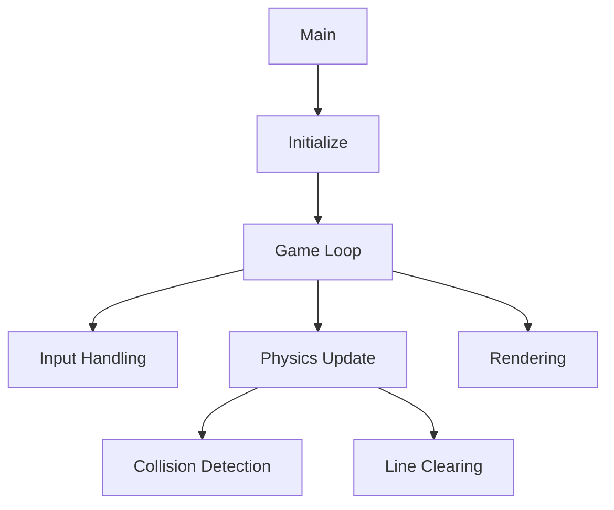

# 🧊 Tetris Console Edition 🎮


A complete implementation of classic Tetris for Windows console, featuring authentic gameplay mechanics, responsive controls, and clean ASCII visualization.

---

## ✨ Features

### 🎮 Core Gameplay

| Feature          | Implementation Details                         |
|------------------|----------------------------------------------|
| Tetromino System | All 7 classic pieces with proper wall kicks |
| Movement        | Smooth left/right/drop controls              |
| Rotation        | Clockwise rotation with collision check      |
| Line Clearing   | Full row detection and removal               |
| Game Over       | Top-out condition detection                  |

### 🖀️ Technical Highlights
```cpp
struct Tetromino {
    vector<vector<int>> shape;  // 2D binary matrix
    int x, y;                   // Board position
};
```

---

## 🚀 Quick Start

### Prerequisites
- Windows OS (for `conio.h`)
- C++17 compatible compiler

### Installation
```sh
# Clone and build
git clone https://github.com/yourusername/tetris-console.git
cd tetris-console
g++ tetris.cpp -o tetris -O2 -std=c++17

# Run the game
./tetris
```

---

## 🎮 Controls

| Key       | Action               | Implementation                      |
|-----------|----------------------|-------------------------------------|
| ← →       | Move horizontally    | `MoveTetromino( ±1, 0 )`             |
| ↓         | Soft drop            | `MoveTetromino( 0, 1 )`               |
| ↑         | Rotate               | `RotateTetromino()` matrix transform |
| Space     | Hard drop            | Repeated soft drops until collision |
| ESC       | Quit                 | Immediate program exit              |

---

## 🛠️ Code Architecture

### 📊 System Overview


### 🔑 Key Components

1. **Game Board**
   - 10×20 grid stored as a 2D character array
   - Visual representation:
```
. . . . . . . . . .
. . . # # # . . . .
# # # # # # # # # #  ← Complete line
```

2. **Tetromino System**
   - Shape definitions as binary matrices:
```cpp
// T-Piece example
{{ {0,1,0},
   {1,1,1} }}
```

---

## 🔍 Deep Dive: Core Functions

### 1. Collision Detection
```cpp
bool IsValidMove(int dx, int dy, const vector<vector<int>>& shape) {
    for (int i = 0; i < shape.size(); i++) {
        for (int j = 0; j < shape[i].size(); j++) {
            if (shape[i][j]) {
                int newX = current.x + j + dx;
                int newY = current.y + i + dy;
                // Boundary checks
                if (newX < 0 || newX >= WIDTH || newY >= HEIGHT ||
                   (newY >= 0 && board[newY][newX] == FILLED))
                    return false;
            }
        }
    }
    return true;
}
```

### 2. Rotation Mechanics
```cpp
void RotateTetromino() {
    // Create rotated matrix
    vector<vector<int>> rotated(current.shape[0].size(),
                               vector<int>(current.shape.size()));
    
    // Transform: (x,y) → (y, size-1-x)
    for (size_t i = 0; i < current.shape.size(); i++) {
        for (size_t j = 0; j < current.shape[0].size(); j++) {
            rotated[j][current.shape.size()-1-i] = current.shape[i][j];
        }
    }
    
    // Only apply if valid position
    if (IsValidMove(0, 0, rotated)) {
        current.shape = rotated;
    }
}
```

### 3. Line Clearing Algorithm
```cpp
void ClearLines() {
    for (int i = HEIGHT - 1; i >= 0; i--) {
        bool full = true;
        // Check line completeness
        for (int j = 0; j < WIDTH; j++) {
            if (board[i][j] == EMPTY) {
                full = false;
                break;
            }
        }
        
        if (full) {
            // Shift lines down
            for (int k = i; k > 0; k--) {
                for (int j = 0; j < WIDTH; j++) {
                    board[k][j] = board[k-1][j];
                }
            }
            // Clear top line
            for (int j = 0; j < WIDTH; j++) board[0][j] = EMPTY;
            i++; // Re-check current row
        }
    }
}
```

---

## 🛠️ Building and Running

### Windows (MinGW)
```sh
g++ tetris.cpp -o tetris -static -std=c++17 -Wall -Wextra
./tetris
```

### Linux (Requires ncurses)
```sh
g++ tetris.cpp -o tetris -lncurses -std=c++17
./tetris
```

---

## 📊 Future Roadmap

1. **Scoring System**
```cpp
int score = 0;
int lines_cleared = 0;
void UpdateScore(int lines) {
    const int points[4] = {100, 300, 500, 800};
    score += points[lines-1];
}
```

2. **Enhanced Features**
   - Next piece preview
   - Hold piece functionality
   - Level progression system

3. **Visual Improvements**
   - Colorized output
   - Animated line clears
   - Main menu screen

---

## 🤝 Contributing Guide

1. Fork the repository
2. Create your feature branch:
```sh
git checkout -b feature/awesome-feature
```
3. Commit your changes:
```sh
git commit -m "Add awesome feature"
```
4. Push to the branch:
```sh
git push origin feature/awesome-feature
```
5. Open a pull request

---

## 📚 License

MIT License - See [LICENSE](https://github.com/B202404016/Tetris-game-/blob/main/LICENSE) for full details.

